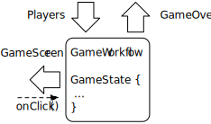
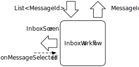
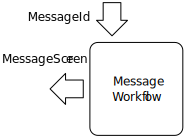
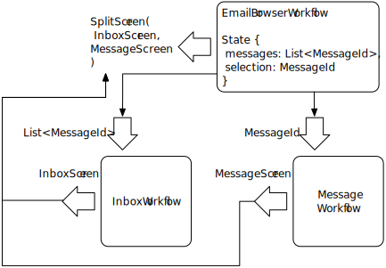

# Workflow Core

This page provides a high level overview of Workflow Core, the UI-agnostic Swift and Kotlin runtimes at the heart of the Workflow libraries.
See [Workflow UI](../ui-concepts) to learn about the companion Android and iOS specific modules.

## What is a Workflow?

A [Workflow](../../glossary#workflow-instance) defines the possible states and behaviors of components of a particular type.
The overall state of a Workflow has two parts:

* [Props](../../glossary#props), configuration information provided by whatever is running the Workflow
* And the private [State](../../glossary#state) managed by the Workflow itself

At any time, a Workflow can be asked to transform its current Props and State into a [Rendering](../../glossary#rendering) that is suitable for external consumption.
A Rendering is typically a simple struct with display data, and event handler functions that can enqueue [Workflow Actions](../../glossary#action) — functions that update State, and which may at the same time emit [Output](../../glossary#output) events.

For example, a Workflow running a simple game might be configured with a description of the participating `Players` as its Props, build `GameScreen` structs when asked to render, and emit a `GameOver` event as Output to signal that is finished.

A workflow Rendering usually serves as a view model in iOS or Android apps, but that is not a requirement.
Again, this page includes no details about how platform specific UI code is driven.
See [Workflow UI](../ui-concepts) for that discussion.

!!! note
     Readers with an Android background should note the lower case _v_ and _m_ of "view model" — this notion has nothing to do with Jetpack `ViewModel`.

## Composing Workflows

Workflows run in a tree, with a single root Workflow declaring it has any number of children for a particular state, each of which can declare children of their own, and so on.
The most common reason to compose Workflows this way is to build big view models (Renderings) out of small ones.

For example, consider an overview / detail split screen, like an email app with a list of messages on the left, and the body of the selected message on the right.
This could be modeled as a trio of Workflows:

**InboxWorkflow**

* Expects a `List<MessageId>` as its Props
* Rendering is an `InboxScreen`, a struct with displayable information derived from its Props, and an `onMessageSelected()` function
* When `onMessageSelected()` is called, a WorkflowAction is executed which emits the given `MessageId` as Output
* Has no private State

**MessageWorkflow**

* Requires a `MessageId` Props value to produce a `MessageScreen` Rendering
* Has no private State, and emits no Output

**EmailBrowserWorkflow**

* State includes a `List<MessageId>`, and the selected `MessageId`
* Rendering is a `SplitScreen` view model, to be assembled from the renderings of the other two Workflows
* Accepts no Props, and emits no Output

When `EmailBrowserWorkflow` is asked to provide its Rendering, it in turn asks for Renderings from its two children.

* It provides the `List<MessageId>` from its state as the Props for `EmailInboxWorkflow` and receives an `InBoxScreen` rendering in return. That `InboxScreen` becomes the left pane of a `SplitScreen` Rendering.
* For the `SplitScreen`'s right pane, the browser Workflow provides the currently selected `MessageId` as input to `EmailMessageWorkflow`, to get a `MessageScreen` rendering.

!!! note
    Note that the two children, `EmailInboxWorkflow` and `EmailMessageWorkflow`, have no knowledge of each other, nor of the context in which they are run.

The `InboxScreen` rendering includes an `onMessageSelected(MessageId)` function.
When that is called, `EmailInboxWorkflow` enqueues an Action function that emits the given `MessageId` as Output.
`EmailBrowserWorkflow`  receives that Output, and enqueues another Action that updates the `selection: MessageId` of its State accordingly.

Whenever such a [Workflow Action cascade](../../glossary#action-cascade) fires, the root Workflow is asked for a new Rendering.
Just as before, `EmailBrowserWorkflow` delegates to its two children for their Renderings, this time providing the new value of `selection` as the updated Props for `MessageWorkflow`.

<!-- ## Workers for I/O and other side effects

There is a big gap in the email app above.
It describes modeling in terms of `MessageId` values, with no description of how actual messages are fetched.

WIP
 -->

## Why does Workflow work this way?

Workflow was built to tame the composition and navigation challenges presented by Square's massive Android and iOS apps.
It lets us write intricate, centralized, well tested code encapsulating the flow through literally hundreds of individual screens.
These days we are able to see and shape the forest, despite all of the trees.

We built it with two core design principals in mind:

* Unidirectional data flow is the best way to stay sane when building UI
* Declarative programming is the best way to define unidirectional data flows

What does that actually mean?

### Unidirectional Data Flow

There is a wealth of information on the web about [Unidirectional Data Flow](https://www.google.com/search?q=unidirectional+data+flow),
but it very simply means that there is a single path along which data travel _from_ your business
logic to your UI, and events travel _to_ your business logic from your UI, and they always and only
travel in one direction along that path. For Workflow, this also implies that the UI is (almost)
stateless, and that the interesting state for your app is centralized and not duplicated.

In practice, this makes program flow much easier to reason about because anytime something happens
in an app, it removes the questions of where the state came from that caused it, which components
got which events, and which sequences of cause and effect actually occurred. It makes unit testing
easier because state and events are explicit, and always live in the same place and flow through the
same APIs, so unit tests only need to test state transitions, for the most part.

### Declarative vs Imperative

Traditionally, most mobile code is [“imperative”](https://en.wikipedia.org/wiki/Imperative_programming)
– it consists of instructions for how to build and display the UI. These instructions can include
control flow like loops. Imperative code is usually stateful, state is usually sprinkled all over
the place, and tends to care about instances and identity. When reading imperative code, you almost
have to run an interpreter and keep all the pieces of state in your head to figure out what it does.

Web UI is traditionally [declarative](https://en.wikipedia.org/wiki/Declarative_programming) – it
describes what to render, and some aspects of how to render it (style), but doesn’t say how to
actually draw it. Declarative code is usually easier to read than imperative code. It
describes what it produces, not how to generate it. Declarative code usually cares more about pure
values than instance identities. However, since computers still need actual instructions at some
point, declarative code requires something else, usually imperative, either a compiler or
interpreter, to actually do something with it.

Workflow code is written in regular Kotlin or Swift, which are both imperative languages, but the
library encourages you to write your logic in a declarative and functional style. The library
manages state and wiring up event handling for you, so the only code you need to write is code that
is actually interesting for your particular problem.

!!! note "A note about functional programming"
    Kotlin and Swift are not strictly functional programming languages, but both have features that allow you to write [functional](https://en.wikipedia.org/wiki/Functional_programming)-style code.
    Functional code discourages side effects and is generally much easier to test than object-oriented code.
    Functional and declarative programming go very well together, and Workflow encourages you to write such code.
