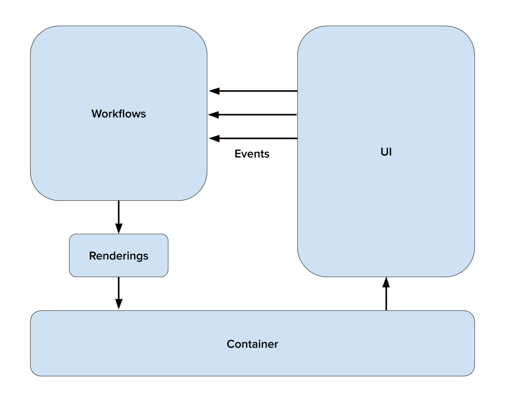

# Core Concepts

## Architectural Concepts

### Unidirectional Data Flow

There is a wealth of information on the web about [Unidirectional Data Flow](https://www.google.com/search?q=unidirectional+data+flow),
but it very simply means that there is a single path along which data travel _from_ your business
logic to your UI, and events travel _to_ your business logic from your UI, and they always and only
travel in one direction along that path. For Workflow, this also implies that the UI is (almost)
stateless, and that the interesting state for your app is centralized and not duplicated.

In practice, this makes program flow much easier to reason about because anytime something happens
in an app, it removes the questions of where the state came from that caused it, which components
got which events, and which sequences of cause and effect actually occurred. It makes unit testing
easier because state and events are explicit, and always live in the same place and flow through the
same APIs, so unit tests only need to test state transitions, for the most part.

### Declarative vs Imperative

Traditionally, most mobile code is [“imperative”](https://en.wikipedia.org/wiki/Imperative_programming)
– it consists of instructions for how to build and display the UI. These instructions can include
control flow like loops. Imperative code is usually stateful, state is usually sprinkled all over
the place, and tends to care about instances and identity. When reading imperative code, you almost
have to run an interpreter and keep all the pieces of state in your head to figure out what it does.

Web UI is traditionally [declarative](https://en.wikipedia.org/wiki/Declarative_programming) – it
describes what to render, and some aspects of how to render it (style), but doesn’t say how to
actually draw it. Declarative code is usually easier to read than imperative code. It
describes what it produces, not how to generate it. Declarative code usually cares more about pure
values than instance identities. However, since computers still need actual instructions at some
point, declarative code requires something else, usually imperative, either a compiler or
interpreter, to actually do something with it.

Workflow code is written in regular Kotlin or Swift, which are both imperative languages, but the
library encourages you to write your logic in a declarative and functional style. The library
manages state and wiring up event handling for you, so the only code you need to write is code that
is actually interesting for your particular problem.

#### A note about functional programming

Kotlin and Swift are not strictly functional programming languages, but both have features that
allow you to write [functional](https://en.wikipedia.org/wiki/Functional_programming)-style code.
Functional code discourages side effects and is generally much easier to test than object-oriented
code. Functional and declarative programming go very well together, and Workflow encourages you to
write such code.

## Core Components

### Workflows

The Workflows at the left of the diagram contain all state and business logic for the application.
This is where network requests happen, navigation decisions are made, models are saved to or loaded
from disk – if it's not UI, it's in this box.

For more information, see [Workflow Core Concepts].

### View Models

The primary job of the Workflows is to emit an observable stream of view models representing the
current state of the application's UI. You will sometimes hear these view models referred to as
'screens', which is just another way to refer to a view model that contains the data for an entire
screen in the app.

For more information, see [Workflow UI Concepts].

### Container

The container is responsible for plumbing together the two separate halves of the application. It
subscribes to the stream of view models that the workflows provide, then implements the logic to
update the live UI whenever a new view model is emitted.

For more information, see [Workflow UI Concepts].

### UI

This is typically conventional platform-specific UI code. One important note is that UI code should
never attempt to navigate using system components (navigation controller pushes, modal presentation,
etc). In this architecture the workflows are in charge – any navigation that happens outside of the
workflow will be disregarded and stomped on during the next update cycle.

For more information, see [Workflow UI Concepts].

### Events

In order for the application to actually do anything, the workflow needs to receive events from the
UI. When the user interacts with the application by, for example, tapping a button, the workflow
receives that event – which may trigger a simple state transition, or more complex behavior such as
a network request.

For more information, see [Workflow Core Concepts].

---

!!! info Swift vs Kotlin
    While the core shape of the libraries is shared by Swift and Kotlin implementations, some of the
    naming and types differ slightly to accommodate each language’s particular type system and
    naming conventions. Where those differences occur in this document, they are noted in "Swift vs
    Kotlin" blurbs. See [Where Swift and Kotlin Libraries Differ](4_where_swift_and_kotlin_libraries_differ.md)
    for an overall summary.

    In general, any time a generic type is referred to as `Foo`, in source code the Swift associated
    type is called `Foo` and the Kotlin type parameter is called `FooT`.

[Workflow Core Concepts]: core-workflow.md
[Workflow UI Concepts]: ui-concepts.md