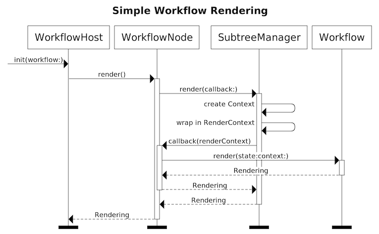

# Implementation Notes

_Work in progress…_

## Swift

### The Render loop

#### Initial pass



The root of your workflow hierarchy gets put into a `WorkflowHost` (if you're using `ContainerViewController` this is created for you). As part of its initializer, `WorkflowHost` creates a `WorkflowNode` that wraps the given root `Workflow` (and keeps track of the `Workflow`'s `State`). It then calls `render()` on the node:

```swift
// WorkflowHost
public init(workflow: WorkflowType, debugger: WorkflowDebugger? = nil) {
    self.debugger = debugger

    self.rootNode = WorkflowNode(workflow: workflow)  // 1. Create the node

    self.mutableRendering = MutableProperty(self.rootNode.render())  // 2. Call render()
```

`WorkflowNode` contains a `SubtreeManager`, whose primary purpose is to manage child workflows (more on this later). When `render()` gets invoked on the node, it calls `render` on the `SubtreeManager` and passes a closure that takes a `RenderContext` and returns a `Rendering` for the `Workflow` associated with the node.

```swift
// WorkflowNode
func render() -> WorkflowType.Rendering {
    return subtreeManager.render { context in
        return workflow.render(
            state: state,
            context: context
        )
    }
}
```

The `SubtreeManager` instantiates a `Context` object (TODO: Explain what this does), wraps it in a `RenderContext` (TODO: Explain why), and invokes the closure that was passed in. This last step generates the `Rendering`. This `Rendering` then gets passed back up the call stack until it reaches the `WorkflowHost`.

#### Composition

In cases where a `Workflow` has child `Workflow`s, the render sequence is similar.

The [tutorial](../tutorial/building-a-workflow/#the-render-context) goes through this in more detail.
