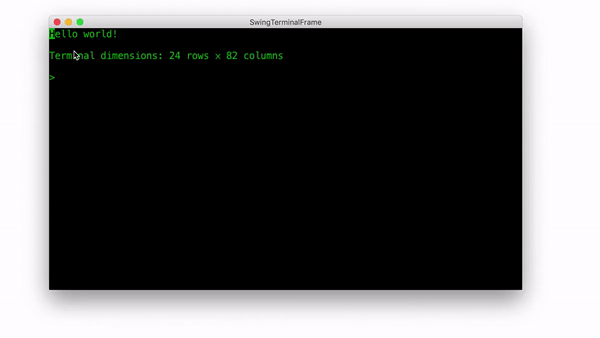

# hello-terminal

## terminal-workflow

Small, simple sample library for writing terminal applications with workflows.

The API entry points are `TerminalWorkflow` and `TerminalWorkflowRunner`. Create one of each of
those, and pass your workflow to `TerminalWorkflowRunner.run()`.

Your `TerminalWorkflow` will get the current size of the terminal as `InputT`, render a
`TerminalRendering` that includes the text to display, foreground and background colors, and an
event handler to receive keystroke events. It can also exit the process by emitting an integer
exit code.

This module delegates to the third-party library [Lanterna](https://github.com/mabe02/lanterna)
to do the actual hard work of talking to the system terminal.

## hello-terminal-app

Sample app demonstrating one possible way of writing terminal applications with workflows.
Makes use of the terminal workflow infrastructure in `:samples:hello-workflow:terminal-workflow`.

Run with `./gradlew :samples:hello-terminal:hello-terminal-app:run`

