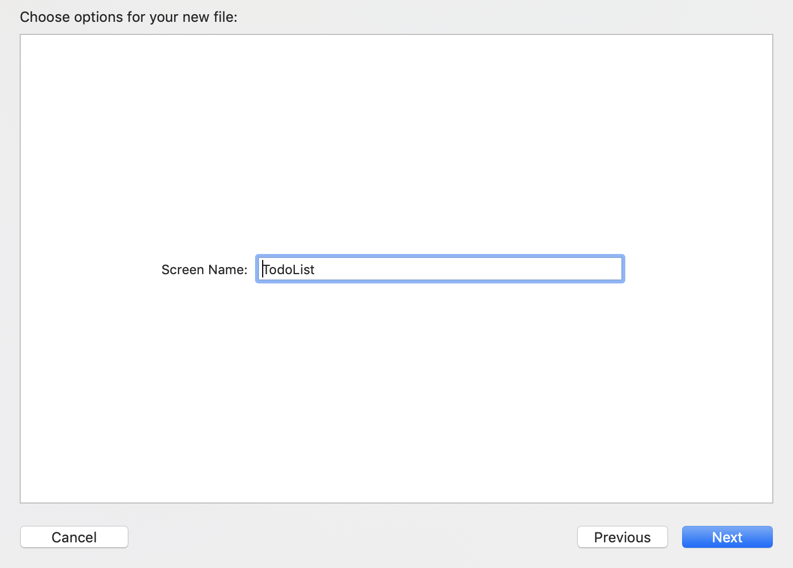
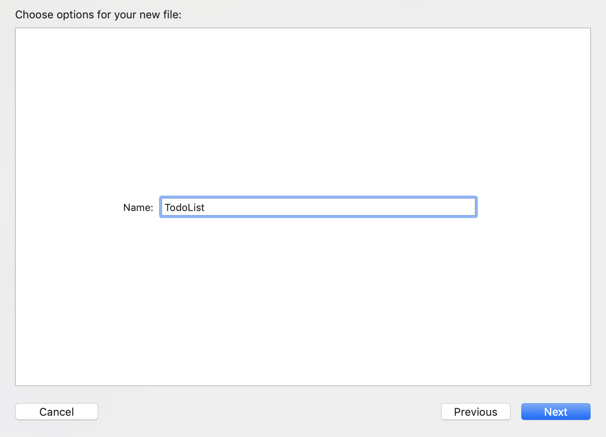
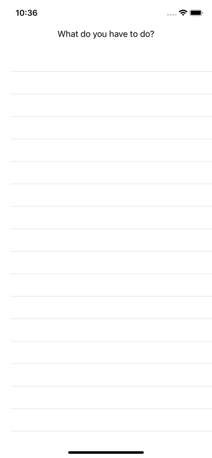
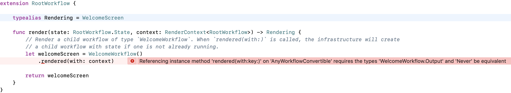
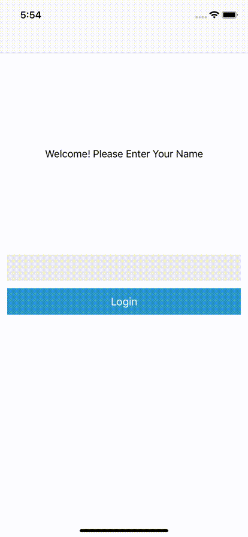

# Step 2

_Multiple Screens and Navigation_

## Setup

To follow this tutorial:
- Open your terminal and run `bundle exec pod install` in the `swift/Samples/Tutorial` directory.
- Open `Tutorial.xcworkspace` and build the `Tutorial` Scheme.

Start from implementation of `Tutorial1` if you're skipping ahead. You can run this by updating the `AppDelegate` to import `Tutorial1` instead of `TutorialBase`.

## Second Workflow

Let's add a second screen and workflow so we have somewhere to land after we finish login. Our next screen will be a list of "TODO" items, as TODO apps are the best apps. To see an example, modify the `TutorialContainerViewController` to show the `TodoListSampleViewController`. It can be removed, as we will be replacing it with a screen and workflow.

Create a new Screen/ViewController pair called `TodoList`:




Add the provided `TodoListView` from `TutorialViews` as a subview to the newly created view controller:

```swift
import TutorialViews


struct TodoListScreen: Screen {
    // This should contain all data to display in the UI

    // It should also contain callbacks for any UI events, for example:
    // var onButtonTapped: () -> Void
}


final class TodoListViewController: ScreenViewController<TodoListScreen> {
    let todoListView: TodoListView

    required init(screen: TodoListScreen, viewRegistry: ViewRegistry) {
        self.todoListView = TodoListView(frame: .zero)
        super.init(screen: screen, viewRegistry: viewRegistry)
        update(with: screen)
    }

    override func viewDidLoad() {
        super.viewDidLoad()

        view.addSubview(todoListView)
    }

    override func viewDidLayoutSubviews() {
        super.viewDidLayoutSubviews()

        todoListView.frame = view.bounds.inset(by: view.safeAreaInsets)
    }
    // The rest of the view controller...
```

And then create the corresponding workflow called "TodoList":



Modify the rendering to return a `TodoListScreen`, we can leave everything else as the default for now:

```swift
// MARK: Rendering

extension TodoListWorkflow {

    typealias Rendering = TodoListScreen

    func render(state: TodoListWorkflow.State, context: RenderContext<TodoListWorkflow>) -> Rendering {
        return TodoListScreen()
    }
}
```

### Showing the new screen and workflow

For now, let's just show this new screen instead of the login screen/workflow. Update the `TutorialContainerViewController` to register to the new screen and show the `TodoListWorkflow`:

```swift
public final class TutorialContainerViewController: UIViewController {
    let containerViewController: UIViewController

    public init() {
        // Create a view registry. This will allow the infrastructure to map `Screen` types to their respective view controller type.
        var viewRegistry = ViewRegistry()
        // Register the `WelcomeScreen` and view controller with the convenience method the template provided.
        viewRegistry.registerWelcomeScreen()
        // Register the `TodoListScreen` and view controller with the convenience method the template provided.
        viewRegistry.registerTodoListScreen()

        // Create a `ContainerViewController` with the `WelcomeWorkflow` as the root workflow, with the view registry we just created.
//        containerViewController = ContainerViewController(
//            workflow: WelcomeWorkflow(),
//            viewRegistry: viewRegistry)
        // Show the TodoList Workflow instead:
        containerViewController = ContainerViewController(
            workflow: TodoListWorkflow(),
            viewRegistry: viewRegistry)

        super.init(nibName: nil, bundle: nil)
    }
```

Run the app again, and now the empty todo list (table view) will be shown:



## Populating the Todo List

The empty list is rather boring, so let's fill it in with some sample data for now. Update the `State` type to include a list of todo model objects and change `makeInitialState` to include a default one:

```swift
// TodoListWorkflow.swift

// MARK: State and Initialization

extension TodoListWorkflow {

    struct State {
        var todos: [TodoModel]
    }

    func makeInitialState() -> TodoListWorkflow.State {
        return State(todos: [TodoModel(title: "Take the cat for a walk", note: "Cats really need their outside sunshine time. Don't forget to walk Charlie. Hamilton is less excited about the prospect.")])
    }

    func workflowDidChange(from previousWorkflow: TodoListWorkflow, state: inout State) {

    }
}
```

Add a `todoTitles` property to the `TodoScreen`, and change `update` to update the `TodoListView` to change what it shows anytime the screen updates:

```swift
struct TodoListScreen: Screen {
    // The titles of the todo items
    var todoTitles: [String]

    // Callback when a todo is selected
    var onTodoSelected: (Int) -> Void
}

final class TodoListViewController: ScreenViewController<TodoListScreen> {
    // ...snipped...

    override func screenDidChange(from previousScreen: TodoListScreen) {
        update(with: screen)
    }

    private func update(with screen: TodoListScreen) {
        // Update the todoList on the view with what the screen provided:
        todoListView.todoList = screen.todoTitles
        todoListView.onTodoSelected = screen.onTodoSelected
    }

}

```

Finally, update the `render` for `TodoListWorkflow` to send the titles of the todo models whenever the screen is updated:

```swift
// MARK: Rendering

extension TodoListWorkflow {

    typealias Rendering = TodoListScreen

    func render(state: TodoListWorkflow.State, context: RenderContext<TodoListWorkflow>) -> Rendering {
        let titles = state.todos.map { (todoModel) -> String in
            return todoModel.title
        }
        return TodoListScreen(
            todoTitles: titles,
            onTodoSelected: { _ in })
    }
}
```

Run the app again, and now there should be a single visible item in the list:


## Composition and Navigation

Now that there are two different screens, we can make our first workflow showing composition with a single parent and two child workflows. Our `WelcomeWorkflow` and `TodoListWorkflow` will be the leaf nodes with a new workflow as the root.

### Root Workflow

Create a new workflow called `Root` with the templates.

We'll start with the `RootWorkflow` returning only showing the `WelcomeScreen` via the `WelcomeWorkflow`. Updated the `Rendering` typealias and `render` to have the `RootWorkflow` defer to a child:

```swift
// MARK: Rendering

extension RootWorkflow {

    typealias Rendering = WelcomeScreen

    func render(state: RootWorkflow.State, context: RenderContext<RootWorkflow>) -> Rendering {
        // Render a child workflow of type `WelcomeWorkflow`. When `rendered(with:)` is called, the infrastructure will create
        // a child workflow with state if one is not already running.
        let welcomeScreen = WelcomeWorkflow()
            .rendered(with: context)

        return welcomeScreen
    }
}
```

However, this won't compile immediately, and the compiler will provide a less than useful error message:



Anytime a child workflow is run, the parent needs a way of converting its `Output` into an `Action` it can handle. The `WelcomeWorkflow`'s output type is currently an empty enum: `enum Output { }`.

For now, delete the `Output` on `WelcomeWorkflow` and replace it with a typealias to `Never`:

```swift
struct WelcomeWorkflow: Workflow {
    typealias Output = Never
}
```

Update the `TutorialContainerViewController` to start at the `RootWorkflow` and we'll see the welcome screen again:

```swift
public final class TutorialContainerViewController: UIViewController {
    let containerViewController: UIViewController

    public init() {
        // ...

        // Create a `ContainerViewController` with the `RootWorkflow` as the root workflow, with the view registry we just created.
        containerViewController = ContainerViewController(
            workflow: RootWorkflow(),
            viewRegistry: viewRegistry)

        super.init(nibName: nil, bundle: nil)
    }
    // ...
}
```

### Navigating between Workflows

Now that there is a root workflow, it can be updated to navigate between the `Welcome` and `TodoList` workflows.

Start by defining the state that needs to be tracked at the root - specifically which screen we're showing, and the actions to login and logout:

```swift
// MARK: State and Initialization

extension RootWorkflow {

    // The state is an enum, and can either be on the welcome screen or the todo list.
    // When on the todo list, it also includes the name provided on the welcome screen
    enum State {
        // The welcome screen via the welcome workflow will be shown
        case welcome
        // The todo list screen via the todo list workflow will be shown. The name will be provided to the todo list.
        case todo(name: String)
    }

    func makeInitialState() -> RootWorkflow.State {
        return .welcome
    }
    // ...
}
```

```swift
// MARK: Actions

extension RootWorkflow {

    enum Action: WorkflowAction {

        typealias WorkflowType = RootWorkflow

        case login(name: String)
        case logout

        func apply(toState state: inout RootWorkflow.State) -> RootWorkflow.Output? {

            switch self {
            case .login(name: let name):
                // When the `login` action is received, change the state to `todo`.
                state = .todo(name: name)
            case .logout:
                // Return to the welcome state on logout.
                state = .welcome
            }
            return nil

        }
    }
}
```

The root workflow is now modeling our states and actions. Soon we will be able to navigate between the welcome and todo list screens.

### Workflow Output

Workflows can only communicate with each other through their "properties" as inputs and "outputs" as actions. When a child workflow emits an output, the parent workflow will receive it and map it into an action they can handle.

Our welcome workflow has a login button that doesn't do anything, and we'll now handle it and let our parent know that we've "logged in" so it can navigate to another screen.

Add an action for `didLogin` and define our `Output` type to be able to message our parent:

```swift
// MARK: Actions

extension WelcomeWorkflow {

    enum Action: WorkflowAction {

        typealias WorkflowType = WelcomeWorkflow

        case nameChanged(name: String)
        case didLogin

        func apply(toState state: inout WelcomeWorkflow.State) -> WelcomeWorkflow.Output? {

            switch self {
            case .nameChanged(name: let name):
                // Update our state with the updated name.
                state.name = name
                // Return `nil` for the output, we want to handle this action only at the level of this workflow.
                return nil

            case .didLogin:
                // Return an output of `didLogin` with the name.
                return .didLogin(name: state.name)
            }
        }
    }
}
```

```swift
struct WelcomeWorkflow: Workflow {
    enum Output {
        case didLogin(name: String)
    }
}
```

And fire the `.didLogin` action any time the login button is pressed:

```swift
// MARK: Rendering

extension WelcomeWorkflow {

    typealias Rendering = WelcomeScreen

    func render(state: WelcomeWorkflow.State, context: RenderContext<WelcomeWorkflow>) -> Rendering {

        // Create a "sink" of type `Action`. A sink is what we use to send actions to the workflow.
        let sink = context.makeSink(of: Action.self)

        return WelcomeScreen(
            name: state.name,
            onNameChanged: { name in
                sink.send(.nameChanged(name: name))
            },
            onLoginTapped: {
                // Whenever the login button is tapped, emit the `.didLogin` action.
                sink.send(.didLogin)
            })
    }
}
```

Finally, map the output event from `WelcomeWorkflow` in `RootWorkflow` to the `login` action:

```swift
// MARK: Rendering

extension RootWorkflow {

    typealias Rendering = WelcomeScreen

    func render(state: RootWorkflow.State, context: RenderContext<RootWorkflow>) -> Rendering {
        // Render a child workflow of type `WelcomeWorkflow`. When `rendered(with:)` is called, the infrastructure will create
        // a child workflow with state if one is not already running.
        let welcomeScreen = WelcomeWorkflow()
            .mapOutput({ output -> Action in
                switch output {
                    // When `WelcomeWorkflow` emits `didLogin`, turn it into our `login` action.
                case .didLogin(name: let name):
                    return .login(name: name)
                }
            })
            .rendered(with: context)

        return welcomeScreen
    }
}
```

### Showing a different workflow from state

Now we are handling the `Output` of `WelcomeWorkflow`, and updating the state to show the `Todo` screen. However, we still need to update our render method to defer to a different workflow.

We'll update the `render` method to show either the `WelcomeWorkflow` or `TodoListWorkflow` depending on the state of `RootWorkflow`

Temporarily define the `Output` of `TodoListWorkflow` as `Never` (we can only go forward!):

```swift
// MARK: Input and Output

struct TodoListWorkflow: Workflow {
    typealias Output = Never
}
```

And update the `render` method of the `RootWorkflow`:

```swift
// MARK: Rendering

extension RootWorkflow {

    typealias Rendering = AnyScreen

    func render(state: RootWorkflow.State, context: RenderContext<RootWorkflow>) -> Rendering {
        switch state {
            // When the state is `.welcome`, defer to the WelcomeWorkflow
        case .welcome:
            // Render a child workflow of type `WelcomeWorkflow`. When `rendered(with:)` is called, the infrastructure will create
            // a child workflow with state if one is not already running.
            let welcomeScreen = WelcomeWorkflow()
                .mapOutput({ output -> Action in
                    switch output {
                    // When `WelcomeWorkflow` emits `didLogin`, turn it into our `login` action.
                    case .didLogin(name: let name):
                        return .login(name: name)
                    }
                })
                .rendered(with: context)

            return AnyScreen(welcomeScreen)

        case .todo(name: let name):
            // When the state is `.todo`, defer to the TodoListWorkflow.
            let todoListScreen = TodoListWorkflow()
                .rendered(with: context)

            return AnyScreen(todoListScreen)
        }

    }
}
```

#### AnyScreen and type erasure

The `Rendering` type of `RootWorkflow` was changed to `AnyScreen` from the `WelcomeScreen` to be able to show different screen types. This is needed as swift is strongly typed, and we are potentially returning different types.

To accomplish this, there is a technique called "type erasure" that is used. Effectively, we wrap the real type into a type that hides the underlying type.

On the infrastructure side, when we display the different screen types, the view controller is swapped out from `Welcome` to instead show the `TodoList`.

This is the "escape hatch" for having a workflow show different screen types based on the state.

This works, but with no animation between the two screens it's pretty unsatisfying. We'll fix that by using a different "container" to provide the missing transition animation.

### Back Stack and "Containers"

We want to put our different screens in a navigation controller. Because we want all of our navigation state to be declarative, we need to use the `BackStackContainer` to do this - by registering and using the `BackStackScreen`:

```swift
public struct BackStackScreen: Screen {
    var items: [Item]

    public init(items: [BackStackScreen.Item]) {
        self.items = items
    }
}
```

The `BackStackScreen` contains a list of all screens in the back stack that are specified on each render pass.

Register the `BackStackScreen` so that we can use it in the TutorialContainerViewController:

```swift
import UIKit
import Workflow
import WorkflowUI
import BackStackContainer


public final class TutorialContainerViewController: UIViewController {
    let containerViewController: UIViewController

    public init() {
        // Create a view registry. This will allow the infrastructure to map `Screen` types to their respective view controller type.
        var viewRegistry = ViewRegistry()
        // Register the `WelcomeScreen` and view controller with the convenience method the template provided.
        viewRegistry.registerWelcomeScreen()
        // Register the `TodoListScreen` and view controller with the convenience method the template provided.
        viewRegistry.registerTodoListScreen()
        // Register the `BackStackContainer`, which provides a container for the `BackStackScreen`.
        viewRegistry.registerBackStackContainer()

        // Create a `ContainerViewController` with the `RootWorkflow` as the root workflow, with the view registry we just created.
        containerViewController = ContainerViewController(
            workflow: RootWorkflow(),
            viewRegistry: viewRegistry)

        super.init(nibName: nil, bundle: nil)
    }
    // ... the rest of the implementation ...
```

And update the `RootWorkflow` to return a `BackStackScreen` with a list of back stack items:

```swift
// Don't forget to import `BackStackContainer` to be able to use `BackStackScreen`.
import BackStackContainer

// ...snipped...

// MARK: Rendering

extension RootWorkflow {

    typealias Rendering = BackStackScreen

    func render(state: RootWorkflow.State, context: RenderContext<RootWorkflow>) -> Rendering {
        // Create a sink to handle the back action from the TodoListWorkflow to logout.
        let sink = context.makeSink(of: Action.self)

        // Our list of back stack items. Will always include the "WelcomeScreen".
        var backStackItems: [BackStackScreen.Item] = []

        let welcomeScreen = WelcomeWorkflow()
            .mapOutput({ output -> Action in
                switch output {
                // When `WelcomeWorkflow` emits `didLogin`, turn it into our `login` action.
                case .didLogin(name: let name):
                    return .login(name: name)
                }
            })
            .rendered(with: context)

        let welcomeBackStackItem = BackStackScreen.Item(
            key: "welcome",
            screen: welcomeScreen,
            // Hide the navigation bar.
            barVisibility: .hidden)

        // Always add the welcome back stack item.
        backStackItems.append(welcomeBackStackItem)

        switch state {
        // When the state is `.welcome`, defer to the WelcomeWorkflow.
        case .welcome:
            // We always add the welcome screen to the backstack, so this is a no op.
            break

        // When the state is `.todo`, defer to the TodoListWorkflow.
        case .todo(name: let name):

            let todoListScreen = TodoListWorkflow()
                .rendered(with: context)

            let todoListBackStackItem = BackStackScreen.Item(
                key: "todoList",
                screen: todoListScreen,
                // Specify the title, back button, and right button.
                barContent: BackStackScreen.BarContent(
                    title: "Welcome \(name)",
                    // When `back` is pressed, emit the .logout action to return to the welcome screen.
                    leftItem: .button(.back(handler: {
                        sink.send(.logout)
                    })),
                    rightItem: .none))

            // Add the TodoListScreen to our BackStackItems.
            backStackItems.append(todoListBackStackItem)
        }

        // Finally, return the BackStackScreen with a list of BackStackScreen.Items
        return BackStackScreen(items: backStackItems)
    }
}
```



Neat! We can now log in and log out, and show the name entered as our title!

Next, we will add our Todo Editing screen.

[Tutorial 3](Tutorial3.md)
