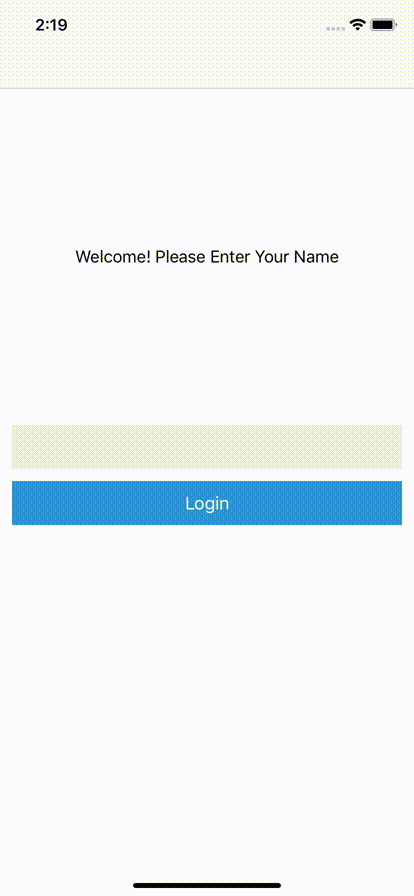

# Step 3

_State throughout a tree of workflows_

## Setup

To follow this tutorial:
- Open your terminal and run `bundle exec pod install` in the `swift/Samples/Tutorial` directory.
- Open `Tutorial.xcworkspace` and build the `Tutorial` Scheme.

Start from implementation of `Tutorial2` if you're skipping ahead. You can run this by updating the `AppDelegate` to import `Tutorial2` instead of `TutorialBase`.

## Editing TODO items

Now that a user can "log in" to their TODO list, we want to add the ability to edit the TODO items listed.

### State ownership

In the workflow framework, data flows _down_ the tree as properties to child workflows, and actions come _up_ as output events (as in the traditional computer science trees that grow downward).

What this means is that state should be created as far down the tree as possible, to limit the scope of state to be as small as possible. Additionally, there should be only one "owner" of the state in the tree - if it's passed farther down the tree, it should be a copy or read-only version of it - so there is no shared mutable state in multiple workflows.

When a child workflow has a copy of the state from its parent, it should change it by emitting an _output_ back to the parent, requesting that it be changed. The child will then receive an updated snapshot of the data from the parent - keeping ownership at a single level of the tree.

This is all a bit abstract, so let's make it more concrete by adding an edit todo item workflow.

### Create an todo edit workflow and screen

Using the templates, create a `TodoEditWorkflow` and `TodoEditScreen`. The `TodoEditSampleViewController` can now be deleted.

#### TodoEditScreen

Import the `TutorialViews` module and add the `TodoEditView` as a subview in the `TodoEditViewController` with the appropriate boilerplate to lay it out correctly.

```swift
// Import the TutorialViews to use the pre-made view.
import TutorialViews
import Workflow
import WorkflowUI


struct TodoEditScreen: Screen {
    // The `TodoEditScreen` is empty to start. We'll add the contents later on.
}


final class TodoEditViewController: ScreenViewController<TodoEditScreen> {
    // The `todoEditView` has all the logic for displaying the todo and editing.
    let todoEditView: TodoEditView

    required init(screen: TodoEditScreen, viewRegistry: ViewRegistry) {
        self.todoEditView = TodoEditView(frame: .zero)

        super.init(screen: screen, viewRegistry: viewRegistry)
        update(with: screen)
    }

    override func viewDidLoad() {
        super.viewDidLoad()

        view.addSubview(todoEditView)
    }

    override func viewDidLayoutSubviews() {
        super.viewDidLayoutSubviews()

        todoEditView.frame = view.bounds.inset(by: view.safeAreaInsets)
    }

    // ...rest of the implementation...
```

This view isn't particularly useful without the data to present it, so update the `TodoEditScreen` to add the properties we need and the callbacks:

```swift
struct TodoEditScreen: Screen {
    // The title of this todo item.
    var title: String
    // The contents, or "note" of the todo.
    var note: String

    // Callback for when the title or note changes
    var onTitleChanged: (String) -> Void
    var onNoteChanged: (String) -> Void
}
```

Then update the view with the data from the screen:

```swift
final class TodoEditViewController: ScreenViewController<TodoEditScreen> {
    // ..rest of the implementation...

    override func screenDidChange(from previousScreen: TodoEditScreen) {
        update(with: screen)
    }

    private func update(with screen: TodoEditScreen) {
        // Update the view with the data from the screen.
        todoEditView.title = screen.title
        todoEditView.note = screen.note
        todoEditView.onTitleChanged = screen.onTitleChanged
        todoEditView.onNoteChanged = screen.onNoteChanged
    }

}
```

Finally, register the `TodoEditScreen` in the `TutorialContainerViewController` with the viewRegistry:

```swift
public final class TutorialContainerViewController: UIViewController {
    let containerViewController: UIViewController

    public init() {
        // Create a view registry. This will allow the infrastructure to map `Screen` types to their respective view controller type.
        var viewRegistry = ViewRegistry()
        // Register the `WelcomeScreen` and view controller with the convenience method the template provided.
        viewRegistry.registerWelcomeScreen()
        // Register the `TodoListScreen` and view controller with the convenience method the template provided.
        viewRegistry.registerTodoListScreen()
        // Register the `BackStackContainer`, which provides a container for the `BackStackScreen`.
        viewRegistry.registerBackStackContainer()
        // Register the `TodoEditScreen` and view controller with the convenience method the template provided.
        viewRegistry.registerTodoEditScreen()

        // Create a `ContainerViewController` with the `RootWorkflow` as the root workflow, with the view registry we just created.
        containerViewController = ContainerViewController(
            workflow: RootWorkflow(),
            viewRegistry: viewRegistry)

        super.init(nibName: nil, bundle: nil)
    }

    // ... rest of the implementation ...
```

#### TodoEditWorkflow

Now that we have our screen and view controller, update the `TodoEditWorkflow` to emit this screen as the rendering.

The `TodoEditWorkflow` needs an initial Todo item passed into it from its parent. It will make a copy of it in its internal state - this can be the "scratch pad" for edits. This allows changes to be made and still be able to discard the changes if the user does not want to save them.

Additionally, we will (finally) use the `workflowDidChange` method. If the edit workflow's parent provides an updated `todo`, it will invalidate the `todo` in `State`, and replace it with the one provided from the parent.

```swift
// MARK: Input and Output

struct TodoEditWorkflow: Workflow {

    // The "Todo" passed from our parent.
    var initialTodo: TodoModel

    enum Output {

    }
}


// MARK: State and Initialization

extension TodoEditWorkflow {

    struct State {
        // The workflow's copy of the Todo item. Changes are local to this workflow.
        var todo: TodoModel
    }

    func makeInitialState() -> TodoEditWorkflow.State {
        return State(todo: initialTodo)
    }

    func workflowDidChange(from previousWorkflow: TodoEditWorkflow, state: inout State) {

        // The `Todo` from our parent changed. Update our internal copy so we are starting from the same item.
        // The "correct" behavior depends on the business logic - would we only want to update if the
        // users hasn't changed the todo from the initial one? Or is it ok to delete whatever edits
        // were in progress if the state from the parent changes?
        if previousWorkflow.initialTodo != self.initialTodo {
            state.todo = self.initialTodo
        }
    }
}
```

Next, define the actions this workflow will handle - specifically the title and note changing from the UI:

```swift
// MARK: Actions

extension TodoEditWorkflow {

    enum Action: WorkflowAction {

        typealias WorkflowType = TodoEditWorkflow

        case titleChanged(String)
        case noteChanged(String)

        func apply(toState state: inout TodoEditWorkflow.State) -> TodoEditWorkflow.Output? {

            switch self {

            case .titleChanged(let title):
                state.todo.title = title

            case .noteChanged(let note):
                state.todo.note = note
            }

            return nil
        }
    }
}
```

Finally, update the `render` method to return a `TodoEditScreen`:

```swift
// MARK: Rendering

extension TodoEditWorkflow {

    typealias Rendering = TodoEditScreen

    func render(state: TodoEditWorkflow.State, context: RenderContext<TodoEditWorkflow>) -> Rendering {
        // The sink is used to send actions back to this workflow.
        let sink = context.makeSink(of: Action.self)

        let todoEditScreen = TodoEditScreen(
            title: state.todo.title,
            note: state.todo.note,
            onTitleChanged: { title in
                sink.send(.titleChanged(title))
            },
            onNoteChanged: { note in
                sink.send(.noteChanged(note))
            })

        return todoEditScreen
    }
}
```

Now the workflow provides a backing for the UI to edit a todo item, but doesn't support saving and discarding changes. Add two `Output`s and actions for these cases:

```swift
// MARK: Input and Output

struct TodoEditWorkflow: Workflow {

    // The "Todo" passed from our parent.
    var initialTodo: TodoModel

    enum Output {
        case discard
        case save(TodoModel)
    }
}

// ..rest of implementation...

// MARK: Actions

extension TodoEditWorkflow {

    enum Action: WorkflowAction {

        typealias WorkflowType = TodoEditWorkflow

        case titleChanged(String)
        case noteChanged(String)
        case discardChanges
        case saveChanges

        func apply(toState state: inout TodoEditWorkflow.State) -> TodoEditWorkflow.Output? {

            switch self {

            case .titleChanged(let title):
                state.todo.title = title

            case .noteChanged(let note):
                state.todo.note = note

            case .discardChanges:
                // Return the .discard output when the discard action is received.
                return .discard

            case .saveChanges:
                // Return the .save output with the current todo state when the save action is received.
                return .save(state.todo)
            }

            return nil
        }
    }
}

// ..rest of implementation...
```

We now need to have a way of getting the `save` and `discard` actions from the screen. We'll put the `TodoEditScreen` inside of a `BackStackScreen.Item`, so that there is a title bar with `save` and `back.Item` as our two buttons.

```swift
// Don't forget to import `BackStackContainer` to be able to use `BackStackScreen`.
import BackStackContainer

// MARK: Rendering

extension TodoEditWorkflow {

    typealias Rendering = BackStackScreen.Item

    func render(state: TodoEditWorkflow.State, context: RenderContext<TodoEditWorkflow>) -> Rendering {
        // The sink is used to send actions back to this workflow.
        let sink = context.makeSink(of: Action.self)

        let todoEditScreen = TodoEditScreen(
            title: state.todo.title,
            note: state.todo.note,
            onTitleChanged: { title in
                sink.send(.titleChanged(title))
            },
            onNoteChanged: { note in
                sink.send(.noteChanged(note))
            })

        let backStackItem = BackStackScreen.Item(
            key: "edit",
            screen: todoEditScreen,
            barContent: BackStackScreen.BarContent(
                title: "Edit",
                leftItem: .button(.back(handler: {
                    sink.send(.discardChanges)
                })),
                rightItem: .button(BackStackScreen.BarContent.Button(
                    content: .text("Save"),
                    handler: {
                        sink.send(.saveChanges)
                }))))
        return backStackItem
    }
}
```

## Todo Editing in the full flow

### Updating the current workflows to prepare to add the edit workflow

We want the todo edit screen to be shown when a user taps on an item on the todo list screen. To do this, we will modify the todo list workflow to show the edit screen when we are editing.

Because the `TodoEditWorkflow` returns a `BackStackScreen.Item`, we will first need to modify it  to return a list of `BackStackScreen.Item`s as the rendering.

```swift
// TodoListWorkflow

import Workflow
import WorkflowUI
import BackStackContainer
import ReactiveSwift


// MARK: Input and Output

struct TodoListWorkflow: Workflow {

    // The name is an input.
    var name: String

    enum Output {
        case back
    }
}

// ...

// MARK: Actions

extension TodoListWorkflow {

    enum Action: WorkflowAction {

        typealias WorkflowType = TodoListWorkflow

        case onBack

        func apply(toState state: inout TodoListWorkflow.State) -> TodoListWorkflow.Output? {

            switch self {

            case .onBack:
                // When a `.onBack` action is received, emit a `.back` output
                return .back
            }

        }
    }
}

// ...

// MARK: Rendering

extension TodoListWorkflow {

    typealias Rendering = [BackStackScreen.Item]

    func render(state: TodoListWorkflow.State, context: RenderContext<TodoListWorkflow>) -> Rendering {

        // Define a sink to be able to send the .onBack action.
        let sink = context.makeSink(of: Action.self)

        let titles = state.todos.map { (todoModel) -> String in
            return todoModel.title
        }
        let todoListScreen = TodoListScreen(
            todoTitles: titles,
            onTodoSelected: { _ in })

        let backStackItem = BackStackScreen.Item(
            key: "list",
            screen: todoListScreen,
            barContent: BackStackScreen.BarContent(
                title: "Welcome \(name)",
                leftItem: .button(.back(handler: {
                    // When the left button is tapped, send the .onBack action.
                    sink.send(.onBack)
                })),
                rightItem: .none))

        return [backStackItem]
    }
}
```

Next, update the `RootWorkflow` to pass the name into the `TodoListWorkflow` and handle the `.back` output:

```swift
// MARK: Rendering

extension RootWorkflow {

    typealias Rendering = BackStackScreen

    func render(state: RootWorkflow.State, context: RenderContext<RootWorkflow>) -> Rendering {
        // Delete the `let sink = context.makeSink(of: ...) as we no longer need a sink.

        // ... rest of the implementation of `render`

        switch state {
        // When the state is `.welcome`, defer to the WelcomeWorkflow.
        case .welcome:
            // We always add the welcome screen to the backstack, so this is a no op.
            break

        // When the state is `.todo`, defer to the TodoListWorkflow.
        case .todo(name: let name):

            let todoBackStackItems = TodoListWorkflow(name: name)
                .mapOutput({ output -> Action in
                    switch output {
                    case .back:
                        // When receiving a `.back` output, treat it as a `.logout` action.
                        return .logout
                    }
                })
                .rendered(with: context)

            // Add the todoBackStackItems to our BackStackItems.
            backStackItems.append(contentsOf: todoBackStackItems)
        }

        // Finally, return the BackStackScreen with a list of BackStackScreen.Items
        return BackStackScreen(items: backStackItems)
    }
}
```

Run the app again to validate it still behaves the same.

### Adding the edit workflow as a child to the `TodoListWorkflow`

Now that the `TodoListWorkflow`'s rendering is a list of BackStackScreen.Items, it can be updated to show the edit workflow when a `Todo` item is tapped.

Modify the state to represent if the list is being viewed, or an item is being edited:

```swift
// MARK: State and Initialization

extension TodoListWorkflow {

    struct State {
        var todos: [TodoModel]
        var step: Step
        enum Step {
            // Showing the list of todo items.
            case list
            // Editing a single item. The state holds the index so it can be updated when a save action is received.
            case edit(index: Int)
        }
    }

    func makeInitialState() -> TodoListWorkflow.State {
        return State(
            todos: [TodoModel(
                title: "Take the cat for a walk",
                note: "Cats really need their outside sunshine time. Don't forget to walk Charlie. Hamilton is less excited about the prospect.")
            ],
            step: .list)
    }

    func workflowDidChange(from previousWorkflow: TodoListWorkflow, state: inout State) {
    }

}
```

Add actions for selecting a todo item as well as saving or discarding the changes:

```swift
// MARK: Actions

extension TodoListWorkflow {

    enum Action: WorkflowAction {

        typealias WorkflowType = TodoListWorkflow

        case onBack
        case selectTodo(index: Int)
        case discardChanges
        case saveChanges(todo: TodoModel, index: Int)

        func apply(toState state: inout TodoListWorkflow.State) -> TodoListWorkflow.Output? {

            switch self {

            case .onBack:
                // When a `.onBack` action is received, emit a `.back` output
                return .back

            case .selectTodo(index: let index):
                // When a todo item is selected, edit it.
                state.step = .edit(index: index)
                return nil

            case .discardChanges:
                // When a discard action is received, return to the list.
                state.step = .list
                return nil

            case .saveChanges(todo: let todo, index: let index):
                // When changes are saved, update the state of that `todo` item and return to the list.
                state.todos[index] = todo

                state.step = .list
                return nil
            }

        }
    }
}
```

Update the `render` method to defer to the `TodoEditWorkflow` when editing:

```swift
// MARK: Rendering

extension TodoListWorkflow {

    typealias Rendering = [BackStackScreen.Item]

    func render(state: TodoListWorkflow.State, context: RenderContext<TodoListWorkflow>) -> Rendering {

        // Define a sink to be able to send actions.
        let sink = context.makeSink(of: Action.self)

        let titles = state.todos.map { (todoModel) -> String in
            return todoModel.title
        }
        let todoListScreen = TodoListScreen(
            todoTitles: titles,
            onTodoSelected: { index in
                // Send the `selectTodo` action when a todo is selected in the UI.
                sink.send(.selectTodo(index: index))
            })

        let todoListItem = BackStackScreen.Item(
            key: "list",
            screen: todoListScreen,
            barContent: BackStackScreen.BarContent(
                title: "Welcome \(name)",
                leftItem: .back(handler: {
                    // When the left button is tapped, send the .onBack action.
                    sink.send(.onBack)
                }),
                rightItem: .none))

        switch state.step {
        case .list:
            // On the "list" step, return just the list screen.
            return [todoListItem]

        case .edit(index: let index):
            // On the "edit" step, return both the list and edit screens.
            let todoEditItem = TodoEditWorkflow(
                initialTodo: state.todos[index])
                .mapOutput({ output -> Action in
                    switch output {

                    case .discard:
                        // Send the discardChanges action when the discard output is received.
                        return .discardChanges

                    case .save(let todo):
                        // Send the saveChanges action when the save output is received.
                        return .saveChanges(todo: todo, index: index)
                    }
                })
                .rendered(with: context)

            return [todoListItem, todoEditItem]
        }
    }
}
```

Now we have a (nearly) fully formed app! Try it out and see how the data flows between the different workflows:



### Data Flow

Looking at what was just built, this demonstrates how state should be handled in a tree of workflows. The `TodoListWorkflow` is responsible for the state of all the todo items.

When an item is edited, the `TodoEditWorkflow` makes a _copy_ of it for its local state. The updates happen from the UI events (changing the title or note). Depending on if the user wants to save (hikes are fun!) or discard the changes (taking the cat for a swim is likely a bad idea), it emits an output of `discard` or `save`.

When a `save` output is emitted, it includes the updated todo model. The parent (`TodoListWorkflow`) updates its internal state for that one item. The child never knows the index of the item being edited, it only has the minimum state of the specific item. This lets the parent be able to safely update its array of todos without being concerned about index-out-of-bounds errors.

If so desired, the `TodoListWorkflow` could have additional checks for saving the changes. For instance, if the todo list was something fetched from a server, it may decide to discard any changes if the list was updated remotely, etc.

## Up Next

We have a pretty fully formed app. However if we want to keep going and adding features, we may want to reshape our tree of workflows. In the next tutorial, we'll cover refactoring and changing the shape of our workflow hierarchy.

[Tutorial 4](Tutorial4.md)
